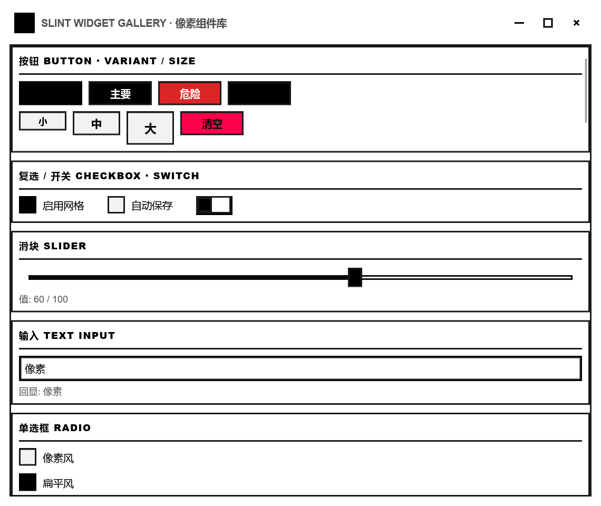

# slint-pixel

基于 **Rust + Slint 1.17** 的像素风可复用组件库：16×16 像素画板 widget、
自绘像素标题栏，以及一套常用像素风控件；附带组件画廊与画板演示程序。

- **可复用**：所有组件通过 `@slint_pixel` 导入到任意 Slint 项目（见下方组件清单）。
- **一键接线**：Rust 侧调用 `install_painter()` / `install_title_bar_controls()`，
  画/擦、清空、导出 PNG、窗口控制全部自动接好。
- **自绘像素标题栏**：无系统边框（`no-frame`），可拖拽、双击最大化，右侧最小化/最大化/关闭。
- **像素画布**：16×16 网格，格子放大 24px 显示（棋盘格 + 网格线 + 立体像素块）。
- **PICO-8 色板**：16 色，点击选色；画笔 1×1 / 2×2 / 3×3；左键画、右键擦除。
- **导出**：一键保存为网格分辨率 PNG（透明背景），存到当前工作目录。
- **跨平台**：仅依赖 `slint` + `image`（纯 Rust），无平台特定代码。



## 组件清单

所有组件都是 `in`/`in-out` 属性 + 回调，宿主可覆盖主题色，无系统依赖、跨平台。

| 组件 | 说明 |
| --- | --- |
| `PixelPainter` | 16×16 像素画板 widget（画布 + 色板 + 工具栏 + 状态栏） |
| `PixelTitleBar` | 可拖拽像素标题栏（拖拽/最小化/最大化/关闭回调） |
| `PixelButton` | 像素按压按钮（按下下沉效果） |
| `PixelCheckBox` | 复选框（像素勾选 + 文字标签） |
| `PixelSwitch` | 开关（滑块滑动动画） |
| `PixelSlider` | 滑块（拖拽取值，min/max，`changed(value)` 回调） |
| `PixelTextInput` | 单行文本输入（占位符 + 焦点高亮 + `accepted`/`edited`） |
| `PixelProgressBar` | 进度条（0..1，可选百分比文字） |
| `PixelBadge` | 徽章/标签 |
| `PixelPanel` | 分组面板（标题 + 内容插槽 `@children`） |
| `PixelDialog` | 模态对话框（遮罩 + 标题 + 内容插槽 + 确定/取消） |
| `PixelRadioButton` | 单选框（独立使用） |
| `PixelRadioGroup` | 单选框组（互斥，`options` 数据驱动） |
| `PixelComboBox` | 下拉选择框（PopupWindow，`open` 可控） |
| `PixelMenu` | 下拉菜单（"---" 项渲染分隔线） |
| `PixelTableView` | 表格（表头 + 数据行 + 选中行回调） |
| `PixelScrollPanel` | 滚动面板（基于 Slint 内置 ScrollView，滚轮/拖拽原生） |
| `PixelCollapsible` | 可折叠面板（高度动画） |
| `PixelAccordion` | 手风琴（`titles`/`contents` 数据驱动，互斥展开） |
| `PixelSidebar` | 侧边栏（导航项 + 选中态 + 内容区 `@children`） |
| `PixelText` / `PixelTitle` | 像素风文本 / 标题（统一字号） |
| `PixelForm` / `PixelFormItem` | 表单容器 / 表单项（左标签 + 右控件插槽） |
| `PixelTextArea` | 多行文本输入（换行 + 占位符） |
| `PixelIconButton` | 图标按钮（通用字形图标 + 悬停高亮） |
| `PixelTooltip` | 悬停提示气泡（延迟显示，包裹任意目标） |
| `PixelBubble` | 富内容气泡/弹出卡片（触发图标 + 箭头 + 内容插槽） |
| `PixelPopconfirm` | 操作确认气泡（触发按钮 + 确定/取消） |
| `PixelAlert` | 警告/提示条（info/success/warning/error，可关闭） |
| `PixelToast` | 通知（自动消失 + 手动关闭） |
| `PixelSpinner` | 加载动画（像素方块循环） |
| `PixelSkeleton` | 骨架屏（加载占位条，呼吸动画） |
| `PixelTabs` | 标签页（数据驱动 + 激活态） |
| `PixelBreadcrumb` | 面包屑（路径导航） |
| `PixelPagination` | 分页（上一页/下一页 + 页码） |
| `PixelDrawer` | 抽屉（右侧滑出 + 遮罩 + 内容插槽） |
| `PixelAvatar` | 像素头像（方块 + 字形/首字） |
| `PixelTag` | 标签（可关闭） |
| `PixelCard` | 卡片（可选标题 + 内容插槽） |
| `PixelNavbar` | 顶栏导航（品牌 + 菜单项 + 右侧插槽） |
| `PixelEmpty` | 空状态（图标 + 标题 + 描述 + 操作插槽） |
| `PixelDivider` | 分隔线（可带文字） |
| PixelStat | 统计卡片（大数字 + 标签 + 变化） |
| PixelWindowResize | 无边框窗口缩放热区（四边/四角，配合 install_window_resize） |
| `Swatch` | 像素风色块（也可作图标按钮右上角数字角标） |

> 主题：默认是 **纯白**（纯白底 + 近黑边框 + 纯黑文字，主色仅黑白，danger 保留红色做功能区分；PICO-8 绘画色板不变）。
> `PixelButton` 支持 `variant`（default/primary/danger/ghost）与 `size`（small/medium/large），对齐 Tailwind 按钮语义。
> 所有组件主题色均为 `in` 属性，宿主可在 `.slint` 里整体覆盖为深色或任意配色。

> 提示：提示气泡请直接用 Slint 内置 `Tooltip`（延迟出现、自动跟随指针）：
> ```slint
> PixelButton {
>     text: "悬停";
>     Tooltip { text: @markdown("**提示文字**"); }
> }
> ```
> 在盒布局中放置组件时，未显式给 `width` 的组件会拉伸占满剩余空间，
> 需要固定宽度的场景请显式指定（如 `PixelButton { width: 90px; }`）。

## 运行演示

```bash
cargo run
```

启动后打开 **组件画廊**（展示全部常用控件），点画廊里的 **打开像素画板 →** 可打开画板窗口。窗口为无边框自绘标题栏，**四边/四角可直接拖拽缩放**，标题栏可拖动/最小化/最大化/关闭。

## 结构（workspace）

```
crates/
├── slint-pixel/                  # 组件库（lib）
│   ├── ui/lib.slint               # @slint_pixel 汇总入口（re-export 全部组件）
│   ├── ui/pixel_painter_widget.slint   # 画板 + 标题栏 + 按钮 + 色块
│   ├── ui/pixel_widgets.slint          # 基础控件：复选/开关/滑块/输入/进度/徽章/面板/对话框
│   ├── ui/pixel_complex.slint         # 进阶控件：单选/下拉/菜单/表格/滚动/手风琴/侧边栏
│   ├── ui/pixel_extra.slint           # 表单/文本/输入/图标按钮/提示/气泡/确认
│   ├── ui/pixel_tailwind.slint        # 对齐 Tailwind：警告/通知/加载/骨架/标签页/面包屑/分页/抽屉/头像/卡片/顶栏/空状态/统计
│   ├── ui/pixel_painter_window.slint   # 成品窗口 PixelPainterWindow
│   └── src/
│       ├── lib.rs                 # library_paths()、接线 trait/宏、install_painter() 等
│       └── canvas.rs              # 画布数据、放大渲染、PNG 导出（含单元测试）
└── slint-pixel-demo/             # 演示程序（bin，作为下游消费者组装窗口）
    ├── ui/gallery.slint           # 组件画廊窗口
    ├── ui/main.slint              # 画板窗口（通过 @slint_pixel 组装）
    └── src/main.rs                # 接线：install_painter / install_title_bar_controls / 打开画板
```

## 在其它 Slint 项目里复用

### 1. 添加依赖

```toml
[dependencies]
slint = "1.17"
slint-pixel = { path = "path/to/slint-pixel/crates/slint-pixel" }

[build-dependencies]
slint-build = "1.17"
slint-pixel = { path = "path/to/slint-pixel/crates/slint-pixel" }
```

### 2. 在 `build.rs` 注册 `@slint_pixel` 库并编译自己的 UI

```rust
fn main() {
    println!("cargo:rerun-if-changed=ui/main.slint");
    let library_paths = slint_pixel::library_paths();
    for path in library_paths.values() {
        println!("cargo:rerun-if-changed={}", path.display());
    }
    let config = slint_build::CompilerConfiguration::new().with_library_paths(library_paths);
    slint_build::compile_with_config("ui/main.slint", config).unwrap();
}
```

### 3. 在 `ui/main.slint` 里导入组件并组装

```slint
import { PixelPainter, PixelTitleBar } from "@slint_pixel";

export component MainWindow inherits Window {
    no-frame: true;
    preferred-width: 720px;
    preferred-height: 560px;

    in-out property <image> canvas-image;
    in-out property <string> status-text: "就绪";

    callback paint(length, length, bool);
    callback clear-canvas();
    callback save-png();
    callback drag-start();
    callback minimize();
    callback toggle-maximize();
    callback close-window();

    VerticalLayout {
        padding: 12px;
        spacing: 10px;
        PixelTitleBar {
            title: "我的像素窗口";
            drag-start => { root.drag-start(); }
            minimize => { root.minimize(); }
            toggle-maximize => { root.toggle-maximize(); }
            close-window => { root.close-window(); }
        }
        PixelPainter {
            canvas-image <=> root.canvas-image;
            status-text <=> root.status-text;
            paint(px, py, erase) => { root.paint(px, py, erase); }
            clear-canvas => { root.clear-canvas(); }
            save-png => { root.save-png(); }
        }
    }
}
```

完整参考：`crates/slint-pixel-demo/ui/main.slint` 与 `crates/slint-pixel-demo/ui/gallery.slint`。

### 4. Rust 侧一键接线

```rust
slint::include_modules!();

// 把生成的 MainWindow 适配到组件库契约（一行宏，无需手写胶水代码）
slint_pixel::impl_painter_ui!(MainWindow);
slint_pixel::impl_title_bar_ui!(MainWindow);

fn main() -> Result<(), Box<dyn std::error::Error>> {
    let ui = MainWindow::new()?;
    slint_pixel::install_painter(&ui);           // 画/擦、清空、导出 PNG
    slint_pixel::install_title_bar_controls(&ui); // 拖拽、最小化、最大化、关闭
    ui.run()?;
    Ok(())
}
```

### 不想写 `.slint`？直接用成品窗口

```rust
fn main() -> Result<(), Box<dyn std::error::Error>> {
    let ui = slint_pixel::PixelPainterWindow::new()?;
    slint_pixel::install_painter(&ui);
    slint_pixel::install_title_bar_controls(&ui);
    ui.run()?;
    Ok(())
}
```

### 自定义主题

所有组件暴露 `in` 主题属性（如 `PixelPainter` 的 `page / panel / panel-light / edge /
shadow / text-color / dim / highlight / danger` 与 `palette`；`PixelSlider` 的
`track / fill / thumb / border / shadow` 等），宿主可在 `.slint` 里直接覆盖。

## 操作（画板）

| 操作 | 说明 |
| --- | --- |
| 左键拖动画布 | 用当前颜色/笔刷作画 |
| 右键拖动画布 | 擦除 |
| 点击色板 | 选择颜色 |
| 画笔 / 橡皮擦 | 切换工具 |
| 1×1 / 2×2 / 3×3 | 切换笔刷大小 |
| 清空 | 清空画布 |
| 存 PNG | 导出 `pixel-art-<时间戳>.png` |
| 标题栏拖拽 | 移动窗口 |
| 标题栏双击 | 最大化 / 还原 |
| 标题栏右侧按钮 | 最小化 / 最大化 / 关闭 |

## 说明

- Slint 在 crates.io 上最新稳定版为 1.17（无 0.17 版本线）。
- Linux Wayland 下合成器可能强制保留系统装饰，`no-frame` 效果取决于合成器。
- 高 DPI（150%）显示器下按物理像素渲染，画布仍保持像素锐利。
- `install_painter` 导出的 PNG 保存在进程当前工作目录。
- 组件清单已对齐 Tailwind 常见 UI：按钮/表单/反馈/导航/数据展示/覆盖层均已覆盖；仍需按需扩展的：日期选择器、上传、时间线等，可在 `pixel_tailwind.slint` 里继续追加（组件均遵循同一黑白像素风主题约定）。