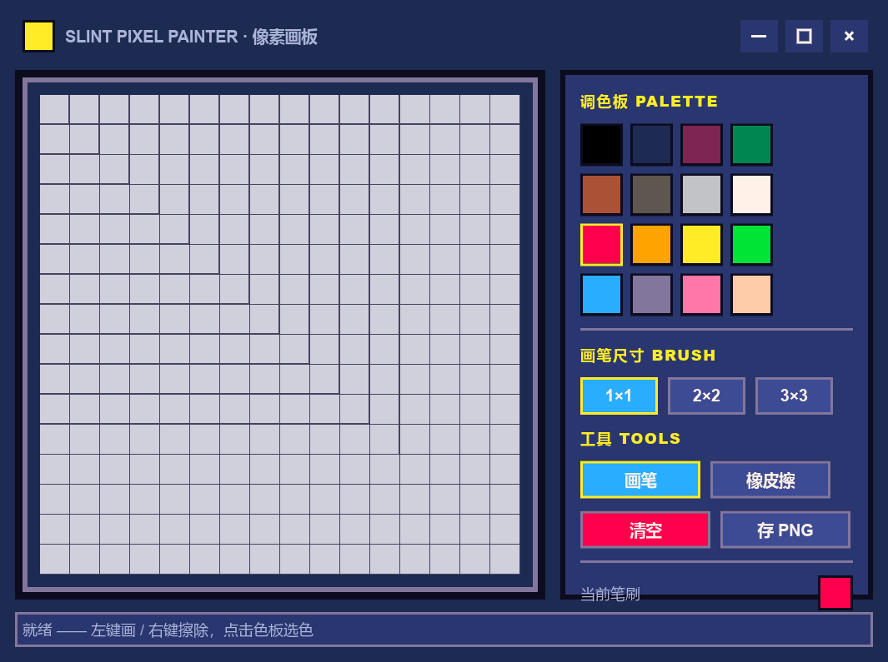

# slint-bitmap

基于 **Rust + Slint 1.17** 的像素风小工具：一个 16×16 像素画板窗口。

- **自绘像素标题栏**：无系统边框（`no-frame`），标题栏可拖拽移动、双击最大化，
  右侧提供 最小化 / 最大化 / 关闭 按钮。
- **像素画布**：16×16 网格，格子放大 24px 显示（棋盘格 + 网格线 + 立体像素块）。
- **PICO-8 色板**：16 色，点击选色。
- **画笔**：1×1 / 2×2 / 3×3 笔刷；左键画、右键擦除。
- **导出**：一键保存为网格分辨率 PNG（透明背景），存到当前工作目录。
- **跨平台**：仅依赖 `slint` + `image`（纯 Rust），无平台特定代码；
  窗口控制使用 Slint/Winit 跨平台 API（Windows / macOS / Linux）。



## 运行

```bash
cargo run
```

## 操作

| 操作 | 说明 |
| --- | --- |
| 左键拖动画布 | 用当前颜色/笔刷作画 |
| 右键拖动画布 | 擦除 |
| 点击色板 | 选择颜色 |
| 画笔 / 橡皮擦 | 切换工具 |
| 1×1 / 2×2 / 3×3 | 切换笔刷大小 |
| 清空 | 清空画布 |
| 存 PNG | 导出 `pixel-art-<时间戳>.png` |
| 标题栏拖拽 | 移动窗口 |
| 标题栏双击 | 最大化 / 还原 |
| 标题栏右侧按钮 | 最小化 / 最大化 / 关闭 |

## 结构

- `ui/pixel_painter.slint` — 像素风 UI（无边框窗口 + 自绘标题栏 + 画布/面板）
- `src/canvas.rs` — 画布数据、放大渲染、PNG 导出（含单元测试）
- `src/main.rs` — 事件接线与窗口控制

## 说明

- Slint 在 crates.io 上最新稳定版为 1.17（无 0.17 版本线）。
- Linux Wayland 下合成器可能强制保留系统装饰，`no-frame` 效果取决于合成器。
- 高 DPI（150%）显示器下按物理像素渲染，画布仍保持像素锐利。