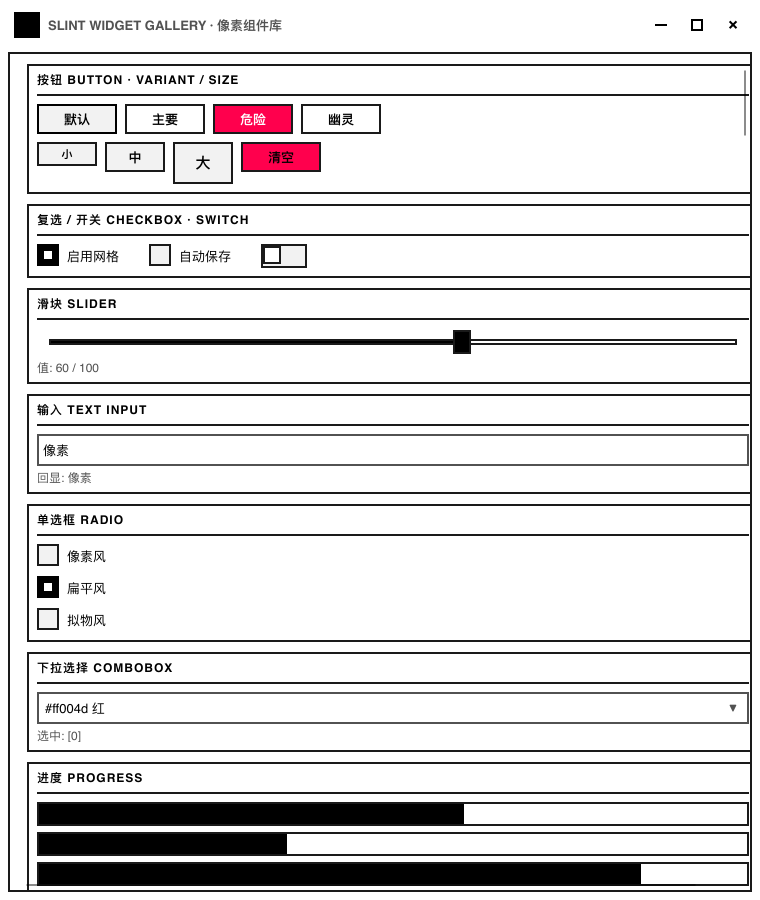
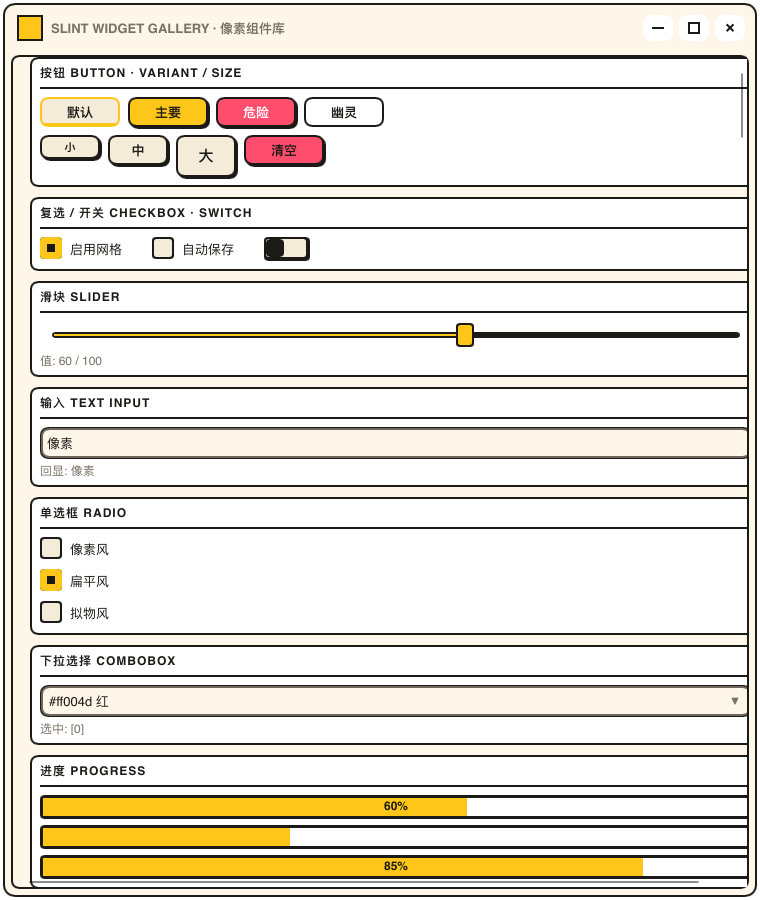
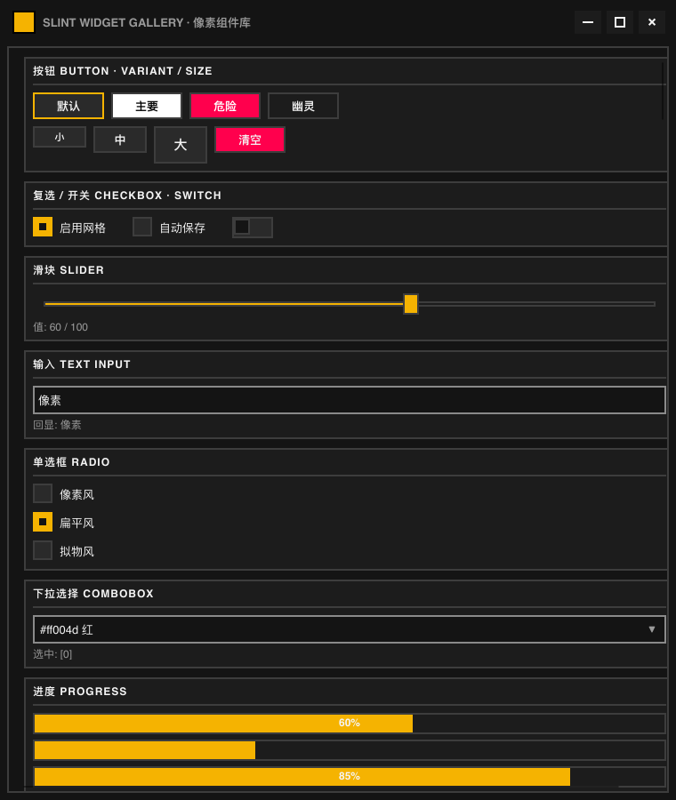
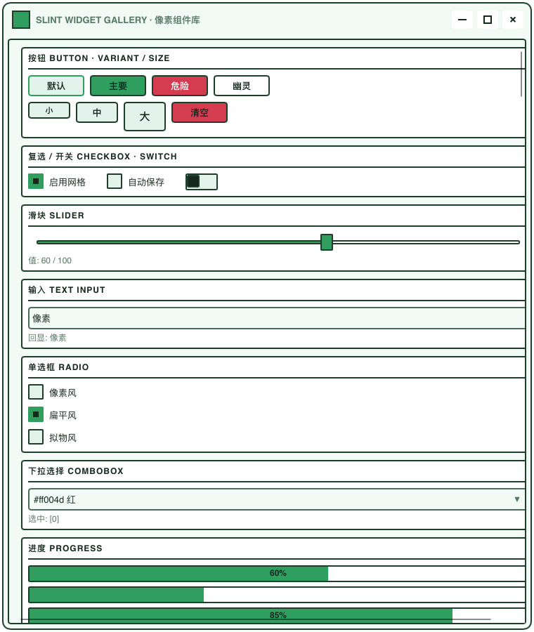
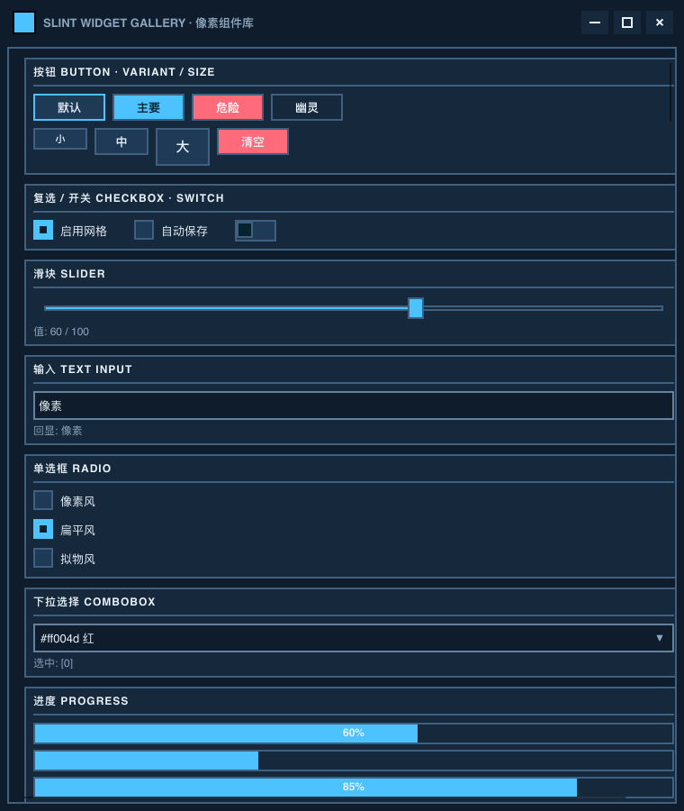
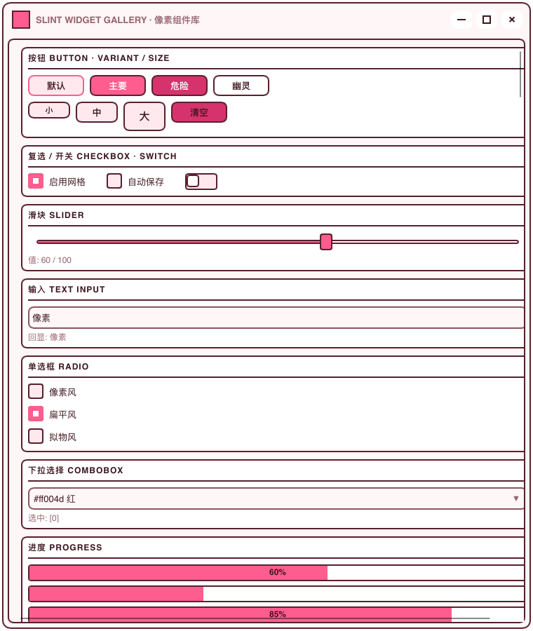
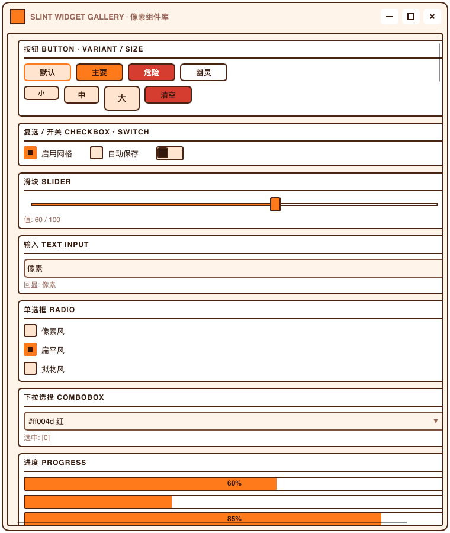
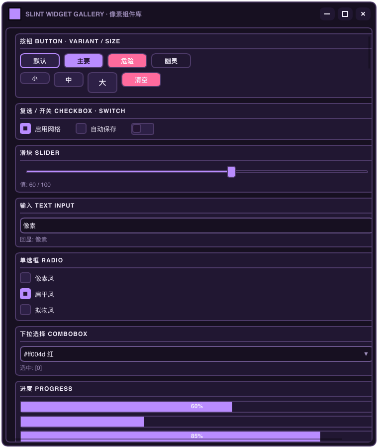
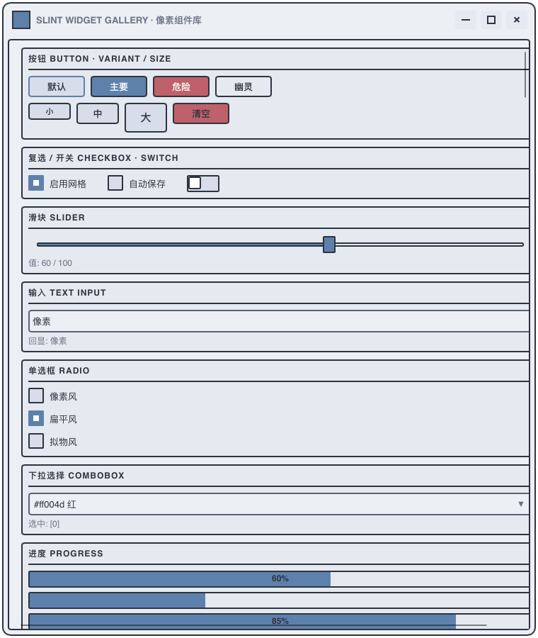
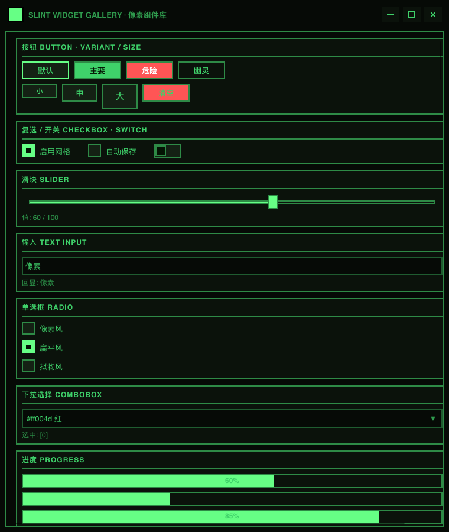

# slint-pixel 内置主题预设 · 配置说明（10 套）

> 面向**高级用户**：每套预设的全部 token 取值、设计取舍与调优指引。
> 普通用户只需要一行：`init => { PixelPresets.apply("sakura"); }`（名字从
> `PixelPresets.names` / `PixelPresets.labels` 两个平行清单取）。

## 所有预设的共同约定

- 每套预设**写全 20 个 token**（`scheme` 明暗开关 + 15 个颜色 + `border-width` /
  `primary-border-width` + `radius`），守卫 `every_preset_writes_every_token`
  逐套核对：漏写会让该 token 回落到 scheme 条件默认值（隐蔽翻车），拼错会被
  Slint 编译器直接拒绝；labels 与 names 数量平行、写了 token 却没登记进 names
  的函数也会被钉出。
- **故意不覆写**的 4 个：`on-ink`（深墨面恒白前景，常量）、`scrim`（模态遮罩，常量）、
  `radius-sm`（派生自 `radius / 2`，保持绑定不断开）、`window-radius`（窗身圆角是
  宿主窗口件——demo 的策略是"主题有圆角就开 12px 窗身圆角，直角就关"）。
- 描边全库一个值：所有预设都是 `border-width = 2px` + `primary-border-width = 2px`。
  想统一变细，宿主一行 `PixelTheme.border-width = 1px` 即可。
- 预设**只写 PixelTheme**：任何组件属性都能在预设之后单独覆盖；任何 token 也能在
  预设之后微调（如 `PixelPresets.grape(); PixelTheme.accent = #ff8fb3;`）。
- 配色纪律（评审实证）：同族色必须**拉开档差**——accent 与 warning/success/info
  同色或近色会让功能语义撞车；中调 accent（非纯黑）上的 on-accent 用**主题墨色**
  而非白字（白字压 #ff7a1a 只有 2.61:1）；暗紫/暗蓝底的 text 保持近白不发灰。
- 色值语义速查：`bg/panel/hover` 是面（底→板→悬停），`edge/border-soft` 是线
  （硬→软），`text/dim` 是字（主→次），`accent/danger/success/warning/info`
  是功能色，`on-accent/on-ink/scrim` 是前景与遮罩。

---

## classic（纯白底 + 近黑描边 + 直角）

**定位**：纯白底 + 近黑描边 + 直角，黑白像素风的极致形态，也是库不给任何预设时的默认值。

| Token | 取值 | 这套主题里的角色 |
| --- | --- | --- |
| `scheme` | `"light"` | 明暗模式开关。预设写全了全部 token，它主要给宿主/组件做语义判断（如 PixelTheme.scheme == "dark"） |
| `bg` | `#ffffff` | 页面/窗口底色，内容区、输入面 |
| `panel` | `#ffffff` | 面板/卡片/轨道/表头的表面色 |
| `hover` | `#f2f2f2` | 悬停面、按下反馈、浅灰井（PDF/打印 staging、验证码面） |
| `edge` | `#1a1a1a` | 主描边/分隔线；也是导航选中项、标签等『深底白字』块的底色 |
| `border-soft` | `#525252` | 输入类组件（文本框/下拉）的软一档描边，比 edge 观感更细 |
| `shadow` | `#000000` | 深色块/硬阴影层；圆角主题里跟 edge 同色，圆角处不露方角；也是视频/码块画面 |
| `text` | `#000000` | 主文字与图标 |
| `dim` | `#525252` | 次要文字/占位/说明文字 |
| `accent` | `#000000` | 强调/激活/选中底/进度填充 |
| `danger` | `#ff004d` | 危险/错误状态 |
| `success` | `#16a34a` | 成功状态 |
| `warning` | `#d97706` | 警告状态 |
| `info` | `#0284c7` | 信息状态 |
| `on-accent` | `#ffffff` | accent 底上的前景色：选中行文字、勾选标记、开关滑块。中调（非纯黑）accent 上必须用主题墨色，白字对比不足 |
| `primary-face` | `#ffffff` | primary 按钮面（variant "primary"） |
| `primary-text` | `#000000` | primary 按钮文字，跟随 on-accent 的取值纪律 |
| `border-width` | `2px` | 全库统一描边宽（所有容器/按钮/输入/小件连同内部线框） |
| `primary-border-width` | `2px` | primary 按钮描边宽（与普通按钮同值，不再粗一档） |
| `radius` | `0px` | 容器/卡片/输入/对话框圆角；小件自动用一半（radius-sm = radius/2） |

**调优提示**：想要纯黑白（不要彩色语义色）时，把 danger/success/warning/info 四个设回 #000000 或 edge 即可。

---

## soft（暖米底 + 墨黑描边 + 暖黄主色 + 8px 大圆角）

**定位**：暖米底 + 墨黑描边 + 暖黄主色 + 8px 大圆角，卡片式协作工具的温软观感，demo 默认预设。

| Token | 取值 | 这套主题里的角色 |
| --- | --- | --- |
| `scheme` | `"light"` | 明暗模式开关。预设写全了全部 token，它主要给宿主/组件做语义判断（如 PixelTheme.scheme == "dark"） |
| `bg` | `#fdf6e9` | 页面/窗口底色，内容区、输入面 |
| `panel` | `#ffffff` | 面板/卡片/轨道/表头的表面色 |
| `hover` | `#f4ebd9` | 悬停面、按下反馈、浅灰井（PDF/打印 staging、验证码面） |
| `edge` | `#1c1a17` | 主描边/分隔线；也是导航选中项、标签等『深底白字』块的底色 |
| `border-soft` | `#6f675c` | 输入类组件（文本框/下拉）的软一档描边，比 edge 观感更细 |
| `shadow` | `#1c1a17` | 深色块/硬阴影层；圆角主题里跟 edge 同色，圆角处不露方角；也是视频/码块画面 |
| `text` | `#1c1a17` | 主文字与图标 |
| `dim` | `#7a7263` | 次要文字/占位/说明文字 |
| `accent` | `#ffc61a` | 强调/激活/选中底/进度填充 |
| `danger` | `#ff4d6d` | 危险/错误状态 |
| `success` | `#16a34a` | 成功状态 |
| `warning` | `#d97706` | 警告状态 |
| `info` | `#2aa9c4` | 信息状态 |
| `on-accent` | `#1c1a17` | accent 底上的前景色：选中行文字、勾选标记、开关滑块。中调（非纯黑）accent 上必须用主题墨色，白字对比不足 |
| `primary-face` | `#ffc61a` | primary 按钮面（variant "primary"） |
| `primary-text` | `#1c1a17` | primary 按钮文字，跟随 on-accent 的取值纪律 |
| `border-width` | `2px` | 全库统一描边宽（所有容器/按钮/输入/小件连同内部线框） |
| `primary-border-width` | `2px` | primary 按钮描边宽（与普通按钮同值，不再粗一档） |
| `radius` | `8px` | 容器/卡片/输入/对话框圆角；小件自动用一半（radius-sm = radius/2） |

**调优提示**：暖黄 accent 上必须用墨色字（on-accent=#1c1a17），白字压黄底会看不清——这套已配好，改 accent 时记得同步改 on-accent。

---

## dark（近黑底 + 琥珀主色 + 直角）

**定位**：近黑底 + 琥珀主色 + 直角，经典深色模式，不挑内容的保守暗色。

| Token | 取值 | 这套主题里的角色 |
| --- | --- | --- |
| `scheme` | `"dark"` | 明暗模式开关。预设写全了全部 token，它主要给宿主/组件做语义判断（如 PixelTheme.scheme == "dark"） |
| `bg` | `#141414` | 页面/窗口底色，内容区、输入面 |
| `panel` | `#1c1c1c` | 面板/卡片/轨道/表头的表面色 |
| `hover` | `#2a2a2a` | 悬停面、按下反馈、浅灰井（PDF/打印 staging、验证码面） |
| `edge` | `#3d3d3d` | 主描边/分隔线；也是导航选中项、标签等『深底白字』块的底色 |
| `border-soft` | `#8a8a8a` | 输入类组件（文本框/下拉）的软一档描边，比 edge 观感更细 |
| `shadow` | `#000000` | 深色块/硬阴影层；圆角主题里跟 edge 同色，圆角处不露方角；也是视频/码块画面 |
| `text` | `#f5f5f5` | 主文字与图标 |
| `dim` | `#9a9a9a` | 次要文字/占位/说明文字 |
| `accent` | `#f5b301` | 强调/激活/选中底/进度填充 |
| `danger` | `#ff004d` | 危险/错误状态 |
| `success` | `#4ade80` | 成功状态 |
| `warning` | `#fbbf24` | 警告状态 |
| `info` | `#38bdf8` | 信息状态 |
| `on-accent` | `#141414` | accent 底上的前景色：选中行文字、勾选标记、开关滑块。中调（非纯黑）accent 上必须用主题墨色，白字对比不足 |
| `primary-face` | `#ffffff` | primary 按钮面（variant "primary"） |
| `primary-text` | `#000000` | primary 按钮文字，跟随 on-accent 的取值纪律 |
| `border-width` | `2px` | 全库统一描边宽（所有容器/按钮/输入/小件连同内部线框） |
| `primary-border-width` | `2px` | primary 按钮描边宽（与普通按钮同值，不再粗一档） |
| `radius` | `0px` | 容器/卡片/输入/对话框圆角；小件自动用一半（radius-sm = radius/2） |

**调优提示**：primary 按钮在这套里保持白面黑字（高对比）；想更统一可设 primary-face=#f5b301、primary-text=#141414。

---

## forest（薄荷雾绿底 + 墨绿描边 + 草绿主色 + 4px 小圆角）

**定位**：薄荷雾绿底 + 墨绿描边 + 草绿主色 + 4px 小圆角，清新自然系，健康/户外类应用气质。

| Token | 取值 | 这套主题里的角色 |
| --- | --- | --- |
| `scheme` | `"light"` | 明暗模式开关。预设写全了全部 token，它主要给宿主/组件做语义判断（如 PixelTheme.scheme == "dark"） |
| `bg` | `#f2faf5` | 页面/窗口底色，内容区、输入面 |
| `panel` | `#ffffff` | 面板/卡片/轨道/表头的表面色 |
| `hover` | `#e3f2ea` | 悬停面、按下反馈、浅灰井（PDF/打印 staging、验证码面） |
| `edge` | `#1e3d2b` | 主描边/分隔线；也是导航选中项、标签等『深底白字』块的底色 |
| `border-soft` | `#4a6b58` | 输入类组件（文本框/下拉）的软一档描边，比 edge 观感更细 |
| `shadow` | `#1e3d2b` | 深色块/硬阴影层；圆角主题里跟 edge 同色，圆角处不露方角；也是视频/码块画面 |
| `text` | `#16281e` | 主文字与图标 |
| `dim` | `#577a66` | 次要文字/占位/说明文字 |
| `accent` | `#2f9e5f` | 强调/激活/选中底/进度填充 |
| `danger` | `#d43d4f` | 危险/错误状态 |
| `success` | `#4ade80` | 成功状态 |
| `warning` | `#c47d0e` | 警告状态 |
| `info` | `#2a7f9e` | 信息状态 |
| `on-accent` | `#16281e` | accent 底上的前景色：选中行文字、勾选标记、开关滑块。中调（非纯黑）accent 上必须用主题墨色，白字对比不足 |
| `primary-face` | `#2f9e5f` | primary 按钮面（variant "primary"） |
| `primary-text` | `#16281e` | primary 按钮文字，跟随 on-accent 的取值纪律 |
| `border-width` | `2px` | 全库统一描边宽（所有容器/按钮/输入/小件连同内部线框） |
| `primary-border-width` | `2px` | primary 按钮描边宽（与普通按钮同值，不再粗一档） |
| `radius` | `4px` | 容器/卡片/输入/对话框圆角；小件自动用一半（radius-sm = radius/2） |

**调优提示**：success(#4ade80) 比 accent(#2f9e5f) 浅一档：绿色主题里『成功』与『选中』必须可分辨，评审实证后已从恒等改开；on-accent 用深墨 #16281e（白字压绿底仅 3.40:1）。

---

## ocean（深海蓝底 + 冰蓝主色 + 直角）

**定位**：深海蓝底 + 冰蓝主色 + 直角，深夜 IDE 气质，深色但不死板。

| Token | 取值 | 这套主题里的角色 |
| --- | --- | --- |
| `scheme` | `"dark"` | 明暗模式开关。预设写全了全部 token，它主要给宿主/组件做语义判断（如 PixelTheme.scheme == "dark"） |
| `bg` | `#0e1c2b` | 页面/窗口底色，内容区、输入面 |
| `panel` | `#16283c` | 面板/卡片/轨道/表头的表面色 |
| `hover` | `#1f3a57` | 悬停面、按下反馈、浅灰井（PDF/打印 staging、验证码面） |
| `edge` | `#40607f` | 主描边/分隔线；也是导航选中项、标签等『深底白字』块的底色 |
| `border-soft` | `#64829e` | 输入类组件（文本框/下拉）的软一档描边，比 edge 观感更细 |
| `shadow` | `#000000` | 深色块/硬阴影层；圆角主题里跟 edge 同色，圆角处不露方角；也是视频/码块画面 |
| `text` | `#e8f1f8` | 主文字与图标 |
| `dim` | `#8aa5bd` | 次要文字/占位/说明文字 |
| `accent` | `#4cc3ff` | 强调/激活/选中底/进度填充 |
| `danger` | `#ff6b7a` | 危险/错误状态 |
| `success` | `#4ade80` | 成功状态 |
| `warning` | `#fbbf24` | 警告状态 |
| `info` | `#2dd4bf` | 信息状态 |
| `on-accent` | `#06222f` | accent 底上的前景色：选中行文字、勾选标记、开关滑块。中调（非纯黑）accent 上必须用主题墨色，白字对比不足 |
| `primary-face` | `#4cc3ff` | primary 按钮面（variant "primary"） |
| `primary-text` | `#06222f` | primary 按钮文字，跟随 on-accent 的取值纪律 |
| `border-width` | `2px` | 全库统一描边宽（所有容器/按钮/输入/小件连同内部线框） |
| `primary-border-width` | `2px` | primary 按钮描边宽（与普通按钮同值，不再粗一档） |
| `radius` | `0px` | 容器/卡片/输入/对话框圆角；小件自动用一半（radius-sm = radius/2） |

**调优提示**：info(#2dd4bf) 走青绿而非蓝族：旧值 #38bdf8 与 accent(#4cc3ff) 色距过近不可分辨，评审实证后改开。

---

## sakura（樱粉白底 + 酒红墨描边 + 樱粉主色 + 8px 大圆角）

**定位**：樱粉白底 + 酒红墨描边 + 樱粉主色 + 8px 大圆角，甜系浅色，二次元/女性向内容友好。

| Token | 取值 | 这套主题里的角色 |
| --- | --- | --- |
| `scheme` | `"light"` | 明暗模式开关。预设写全了全部 token，它主要给宿主/组件做语义判断（如 PixelTheme.scheme == "dark"） |
| `bg` | `#fff6f8` | 页面/窗口底色，内容区、输入面 |
| `panel` | `#ffffff` | 面板/卡片/轨道/表头的表面色 |
| `hover` | `#ffe9ef` | 悬停面、按下反馈、浅灰井（PDF/打印 staging、验证码面） |
| `edge` | `#57202e` | 主描边/分隔线；也是导航选中项、标签等『深底白字』块的底色 |
| `border-soft` | `#8a5560` | 输入类组件（文本框/下拉）的软一档描边，比 edge 观感更细 |
| `shadow` | `#57202e` | 深色块/硬阴影层；圆角主题里跟 edge 同色，圆角处不露方角；也是视频/码块画面 |
| `text` | `#3d1620` | 主文字与图标 |
| `dim` | `#97656f` | 次要文字/占位/说明文字 |
| `accent` | `#ff5d8f` | 强调/激活/选中底/进度填充 |
| `danger` | `#d6336c` | 危险/错误状态 |
| `success` | `#2f9e5f` | 成功状态 |
| `warning` | `#d98e04` | 警告状态 |
| `info` | `#4a7ddb` | 信息状态 |
| `on-accent` | `#3d1620` | accent 底上的前景色：选中行文字、勾选标记、开关滑块。中调（非纯黑）accent 上必须用主题墨色，白字对比不足 |
| `primary-face` | `#ff5d8f` | primary 按钮面（variant "primary"） |
| `primary-text` | `#3d1620` | primary 按钮文字，跟随 on-accent 的取值纪律 |
| `border-width` | `2px` | 全库统一描边宽（所有容器/按钮/输入/小件连同内部线框） |
| `primary-border-width` | `2px` | primary 按钮描边宽（与普通按钮同值，不再粗一档） |
| `radius` | `8px` | 容器/卡片/输入/对话框圆角；小件自动用一半（radius-sm = radius/2） |

**调优提示**：高饱和粉只给 accent/danger，文字描边一律酒红墨；on-accent 也是酒红墨 #3d1620（白字压粉底仅 2.91:1）——甜系不能丢对比。

---

## sunset（蜜瓜橙底 + 焦墨描边 + 橘红主色 + 6px 圆角）

**定位**：蜜瓜橙底 + 焦墨描边 + 橘红主色 + 6px 圆角，活力暖橙，促销/餐饮/运动类气质。

| Token | 取值 | 这套主题里的角色 |
| --- | --- | --- |
| `scheme` | `"light"` | 明暗模式开关。预设写全了全部 token，它主要给宿主/组件做语义判断（如 PixelTheme.scheme == "dark"） |
| `bg` | `#fff4ea` | 页面/窗口底色，内容区、输入面 |
| `panel` | `#ffffff` | 面板/卡片/轨道/表头的表面色 |
| `hover` | `#ffe5cf` | 悬停面、按下反馈、浅灰井（PDF/打印 staging、验证码面） |
| `edge` | `#4a2413` | 主描边/分隔线；也是导航选中项、标签等『深底白字』块的底色 |
| `border-soft` | `#7d5140` | 输入类组件（文本框/下拉）的软一档描边，比 edge 观感更细 |
| `shadow` | `#4a2413` | 深色块/硬阴影层；圆角主题里跟 edge 同色，圆角处不露方角；也是视频/码块画面 |
| `text` | `#33180c` | 主文字与图标 |
| `dim` | `#97685a` | 次要文字/占位/说明文字 |
| `accent` | `#ff7a1a` | 强调/激活/选中底/进度填充 |
| `danger` | `#d43d2f` | 危险/错误状态 |
| `success` | `#3d9954` | 成功状态 |
| `warning` | `#c77800` | 警告状态 |
| `info` | `#3d7fc4` | 信息状态 |
| `on-accent` | `#33180c` | accent 底上的前景色：选中行文字、勾选标记、开关滑块。中调（非纯黑）accent 上必须用主题墨色，白字对比不足 |
| `primary-face` | `#ff7a1a` | primary 按钮面（variant "primary"） |
| `primary-text` | `#33180c` | primary 按钮文字，跟随 on-accent 的取值纪律 |
| `border-width` | `2px` | 全库统一描边宽（所有容器/按钮/输入/小件连同内部线框） |
| `primary-border-width` | `2px` | primary 按钮描边宽（与普通按钮同值，不再粗一档） |
| `radius` | `6px` | 容器/卡片/输入/对话框圆角；小件自动用一半（radius-sm = radius/2） |

**调优提示**：warning(#c77800) 故意比 accent(#ff7a1a) 暗一档：同族色里警告必须压过主色才分得清；on-accent 用焦墨 #33180c（白字压橘底仅 2.61:1，全库最差，已修）。

---

## grape（紫夜底 + 薰衣草紫主色 + 8px 大圆角）

**定位**：紫夜底 + 薰衣草紫主色 + 8px 大圆角，柔和暗紫，深夜阅读/音乐类应用气质。

| Token | 取值 | 这套主题里的角色 |
| --- | --- | --- |
| `scheme` | `"dark"` | 明暗模式开关。预设写全了全部 token，它主要给宿主/组件做语义判断（如 PixelTheme.scheme == "dark"） |
| `bg` | `#171021` | 页面/窗口底色，内容区、输入面 |
| `panel` | `#211732` | 面板/卡片/轨道/表头的表面色 |
| `hover` | `#2d2046` | 悬停面、按下反馈、浅灰井（PDF/打印 staging、验证码面） |
| `edge` | `#4d3a68` | 主描边/分隔线；也是导航选中项、标签等『深底白字』块的底色 |
| `border-soft` | `#6b558c` | 输入类组件（文本框/下拉）的软一档描边，比 edge 观感更细 |
| `shadow` | `#000000` | 深色块/硬阴影层；圆角主题里跟 edge 同色，圆角处不露方角；也是视频/码块画面 |
| `text` | `#f1ecfa` | 主文字与图标 |
| `dim` | `#9c8cb8` | 次要文字/占位/说明文字 |
| `accent` | `#b98cff` | 强调/激活/选中底/进度填充 |
| `danger` | `#ff6b9d` | 危险/错误状态 |
| `success` | `#5fd68a` | 成功状态 |
| `warning` | `#f5c542` | 警告状态 |
| `info` | `#8ab4ff` | 信息状态 |
| `on-accent` | `#241533` | accent 底上的前景色：选中行文字、勾选标记、开关滑块。中调（非纯黑）accent 上必须用主题墨色，白字对比不足 |
| `primary-face` | `#b98cff` | primary 按钮面（variant "primary"） |
| `primary-text` | `#241533` | primary 按钮文字，跟随 on-accent 的取值纪律 |
| `border-width` | `2px` | 全库统一描边宽（所有容器/按钮/输入/小件连同内部线框） |
| `primary-border-width` | `2px` | primary 按钮描边宽（与普通按钮同值，不再粗一档） |
| `radius` | `8px` | 容器/卡片/输入/对话框圆角；小件自动用一半（radius-sm = radius/2） |

**调优提示**：紫色底上文字务必保持近白（#f1ecfa）——用纯白发灰是暗紫主题最常踩的坑。

---

## nord（冷灰蓝底 + 雾蓝主色 + 4px 小圆角）

**定位**：冷灰蓝底 + 雾蓝主色 + 4px 小圆角，Nord 调色板低饱和路线，长时间工作不刺眼。

| Token | 取值 | 这套主题里的角色 |
| --- | --- | --- |
| `scheme` | `"light"` | 明暗模式开关。预设写全了全部 token，它主要给宿主/组件做语义判断（如 PixelTheme.scheme == "dark"） |
| `bg` | `#eceff4` | 页面/窗口底色，内容区、输入面 |
| `panel` | `#e5e9f0` | 面板/卡片/轨道/表头的表面色 |
| `hover` | `#d8dee9` | 悬停面、按下反馈、浅灰井（PDF/打印 staging、验证码面） |
| `edge` | `#2e3440` | 主描边/分隔线；也是导航选中项、标签等『深底白字』块的底色 |
| `border-soft` | `#5a6273` | 输入类组件（文本框/下拉）的软一档描边，比 edge 观感更细 |
| `shadow` | `#2e3440` | 深色块/硬阴影层；圆角主题里跟 edge 同色，圆角处不露方角；也是视频/码块画面 |
| `text` | `#2e3440` | 主文字与图标 |
| `dim` | `#6b7486` | 次要文字/占位/说明文字 |
| `accent` | `#5e81ac` | 强调/激活/选中底/进度填充 |
| `danger` | `#bf616a` | 危险/错误状态 |
| `success` | `#a3be8c` | 成功状态 |
| `warning` | `#d08770` | 警告状态 |
| `info` | `#81a1c1` | 信息状态 |
| `on-accent` | `#ffffff` | accent 底上的前景色：选中行文字、勾选标记、开关滑块。中调（非纯黑）accent 上必须用主题墨色，白字对比不足 |
| `primary-face` | `#5e81ac` | primary 按钮面（variant "primary"） |
| `primary-text` | `#ffffff` | primary 按钮文字，跟随 on-accent 的取值纪律 |
| `border-width` | `2px` | 全库统一描边宽（所有容器/按钮/输入/小件连同内部线框） |
| `primary-border-width` | `2px` | primary 按钮描边宽（与普通按钮同值，不再粗一档） |
| `radius` | `4px` | 容器/卡片/输入/对话框圆角；小件自动用一半（radius-sm = radius/2） |

**调优提示**：warning 用的是 Nord 橙系 #d08770 而非经典黄 #ebcb8b——黄在浅底上几乎看不见，这是 Nord 浅色主题的标准取舍。

---

## terminal（纯黑底 + 磷光绿字/框 + 直角）

**定位**：纯黑底 + 磷光绿字/框 + 直角，CRT 终端复古风——文字本身就是绿色的。

| Token | 取值 | 这套主题里的角色 |
| --- | --- | --- |
| `scheme` | `"dark"` | 明暗模式开关。预设写全了全部 token，它主要给宿主/组件做语义判断（如 PixelTheme.scheme == "dark"） |
| `bg` | `#060a06` | 页面/窗口底色，内容区、输入面 |
| `panel` | `#0b120b` | 面板/卡片/轨道/表头的表面色 |
| `hover` | `#142114` | 悬停面、按下反馈、浅灰井（PDF/打印 staging、验证码面） |
| `edge` | `#2e8a46` | 主描边/分隔线；也是导航选中项、标签等『深底白字』块的底色 |
| `border-soft` | `#1f5c30` | 输入类组件（文本框/下拉）的软一档描边，比 edge 观感更细 |
| `shadow` | `#000000` | 深色块/硬阴影层；圆角主题里跟 edge 同色，圆角处不露方角；也是视频/码块画面 |
| `text` | `#3fd16a` | 主文字与图标 |
| `dim` | `#2f9a4d` | 次要文字/占位/说明文字 |
| `accent` | `#66ff85` | 强调/激活/选中底/进度填充 |
| `danger` | `#ff5555` | 危险/错误状态 |
| `success` | `#a3e635` | 成功状态 |
| `warning` | `#ffbb33` | 警告状态 |
| `info` | `#33bbee` | 信息状态 |
| `on-accent` | `#041404` | accent 底上的前景色：选中行文字、勾选标记、开关滑块。中调（非纯黑）accent 上必须用主题墨色，白字对比不足 |
| `primary-face` | `#3fd16a` | primary 按钮面（variant "primary"） |
| `primary-text` | `#041404` | primary 按钮文字，跟随 on-accent 的取值纪律 |
| `border-width` | `2px` | 全库统一描边宽（所有容器/按钮/输入/小件连同内部线框） |
| `primary-border-width` | `2px` | primary 按钮描边宽（与普通按钮同值，不再粗一档） |
| `radius` | `0px` | 容器/卡片/输入/对话框圆角；小件自动用一半（radius-sm = radius/2） |

**调优提示**：这是唯一 text 为彩色的预设；success 用 lime #a3e635 与正文磷光绿分离（评审实证旧值恒等撞车）；edge/text/accent 三档绿色（#2e8a46/#3fd16a/#66ff85）的层次是精心调的，别合并成一档。

---
